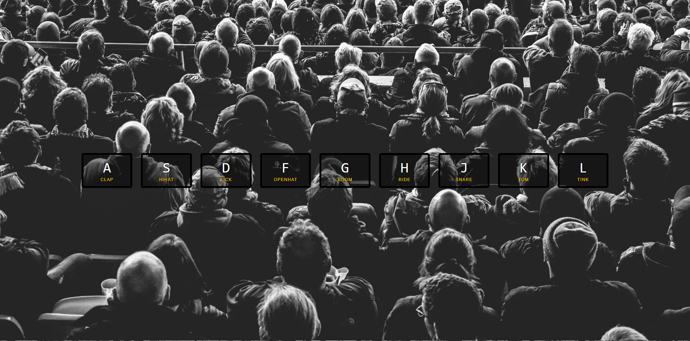

# 01 - JavaScript Drum Kit



鍵盤打鼓，當上按下 'A', 'S', 'D', 'F', 'G', 'H', 'J', 'K', 'L' 時，對應的按鍵**產生高亮效果**與**播放音效**，在按下其他鍵後會關閉該特效並於新按鍵中啟用。

## Step 步驟

1. 監聽 `keydown` - 鍵盤事件 - 播放音效函式
    * 利用 `window.addEventListener('keydown', playSound);` 來監聽鍵盤動作。
1. 建立 `functionplaySound`
    * 利用 `setInterval(setDate, 1000);` 每秒取得當前時間。
1. 利用當前時間來取得對應角度
    * 利用傳入的 `e.keyCode` 來取得對應的 `audio` 標籤及該按鍵的元素標籤
    * 判斷傳入的 `e.keyCode` 是否有對應的 `audio` 標籤，若無則退出
    * 使對應的元素加上 `playing` 樣式，產生對應的典及特效
    * 使對應的 `audio` 播放時間為 0
    * 播放對應的音檔
1. 新增 `transitionend listener`
    * 偵測所有包含 `className='key'` 的元件
    * 當該元件觸發特效並結束時（`transitionend`），呼叫 `removeTransition`
1. 建立 `removeTransition`
    * 判斷傳入的 `propretyName` 是否為 `transform`，若否則退出
    * 若為 `transform`，則移除 `playing` 樣式

## Javascript

語法與備註。

### `Array.from`

`querySelectorAll` 返回的是 `nodeList`， `nodeList` 跟 `Array` 是不同的！

```js
const keys = Array.from(document.querySelectorAll('.key'));
```

### ES6 樣板字面值

```js
const audio = document.querySelector(`audio[data-key="${e.keyCode}"]`);
const key = document.querySelector(`div[data-key="${e.keyCode}"]`);
```

### ES6 箭頭函式 ( Arrow Function )

```js
keys.forEach(function (key) {
    return key.addEventListener('transitionend', removeTransition, false);
});

// 箭頭函式
keys.forEach(key => key.addEventListener('transitionend', removeTransition, false));

// 補充: 如果沒參數要傳，可用空括號代替
let exampleFunction = () => {
    // ...
};
```

## CSS

語法與備註。

### `display:flex`

`flex` 應該是 Flexbox 裏頭最重要的屬性，依照先後順序分別是 `flex-grow`、`flex-shrink` 和 `flex-basis`，如果 `flex` 只填了一個數值（無單位），那麼預設就是以 `flex-grow` 的方式呈現。

> 註解： 2017 ~ 2018 年，CSS Flex 屬性，未完全普及化，對許有些人來說還是新的語法。

```css
.keys {
    display: flex;
    /* 垂直置中 */
    align-items: center;
    /* 水平置中 */
    justify-content: center;
    /* flex: flex-grow｜flex-shrink｜flex-basis */
    flex: 1;
    min-height: 100vh;
}
```

> * [MUKI space* - CSS Flexbox 介紹與解析](http://muki.tw/tech/css-flexbox/2/)
> * [OXXO - 深入解析 CSS Flexbox](http://www.oxxostudio.tw/articles/201501/css-flexbox.html)

## 解決難點

動動腦時間！

### 如何將鍵盤按鍵與頁面按鈕對應起來？

連接的幫手是 `keydown` 事件中的 `keyCode` 屬性，`keyCode` 屬性的值和 ASCII 編碼值相同（對應小寫字母）。這網站可以用按鍵盤來查看對應的鍵碼 [keycode.info](http://keycode.info/)。

### 選取相對的按鈕

運用 `data-key` 儲存對應的代碼，取得 `keyCode` 以此為線索，`querySelector` 選取器的運用，操作對應的按鈕及音頻。

```js
const audio = document.querySelector(`audio[data-key="${e.keyCode}"]`);
const key = document.querySelector(`div[data-key="${e.keyCode}"]`);
```

### 如何播放音效，並保證按鍵被按住不放時，可以馬上響起連續鼓點聲？

播放音效需要取的 HTMLmediaElement(audio) 標籤在透過 javascript 操作。

```html
<!-- 指定音源 -->
<audio src="sound/a.mp3"></audio>
```

```js
// 進行播放
audio.play();
```

每次播放音頻之前，設置播放時間戳為 0。

```js
// 指定播放秒數
audio.currentTime = 0;
```

### 如何使頁面按鈕恢復原狀？

監聽 `transitionened` 事件，它在 `CSS transition` 結束後被觸發！可以利用這個事件，每次打鼓的效果（尺寸變大，顏色變化）完成之後，去除相應樣式。

監聽 `transitionened` 事件中，發生轉換的樣式屬性有許多個（box-shadow、transform、border-color...等等），添加一個判斷語句，使每發生一次按鍵事件時，只去除一次樣式。

```js
funciton remove(event) {
    if (event.propertyName !== 'transform') return;
    this.classList.remove('playing');
    // event.target.classList.remove('playing');
}
```